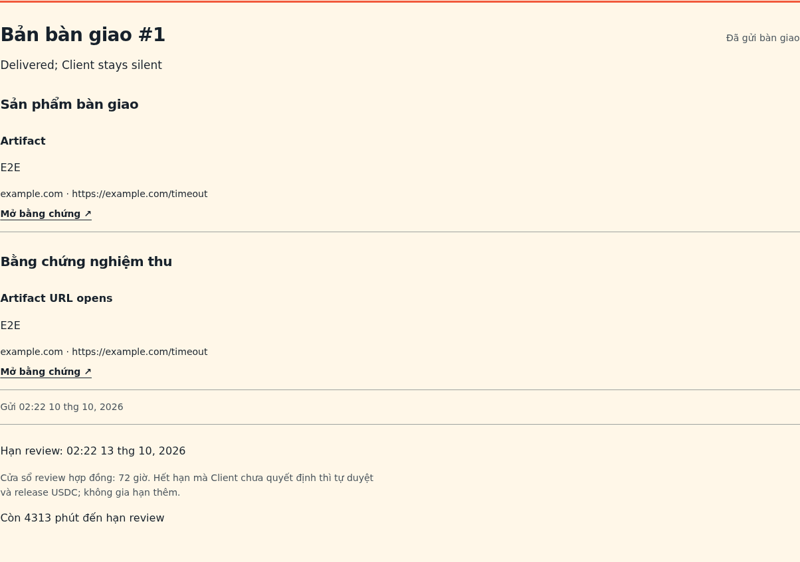
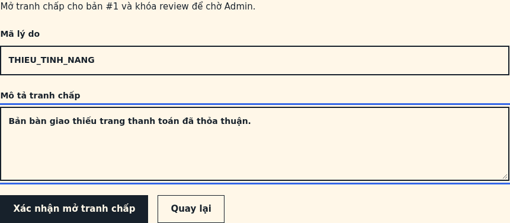
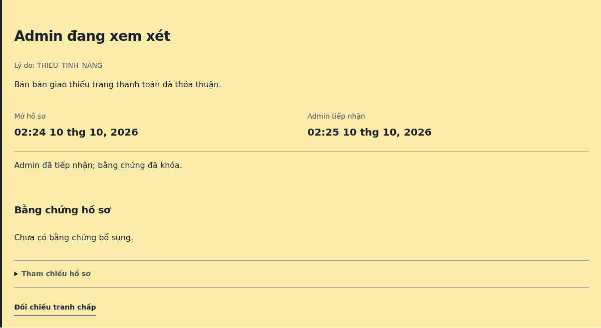
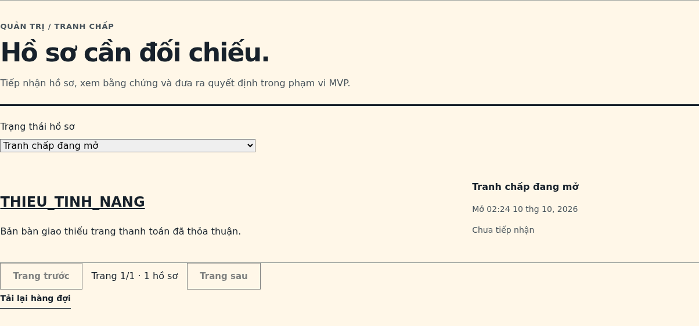
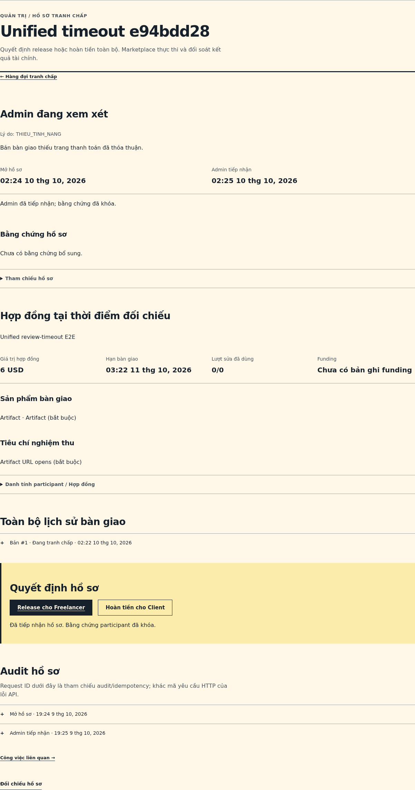
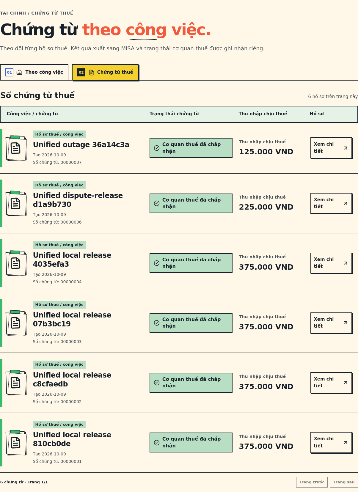
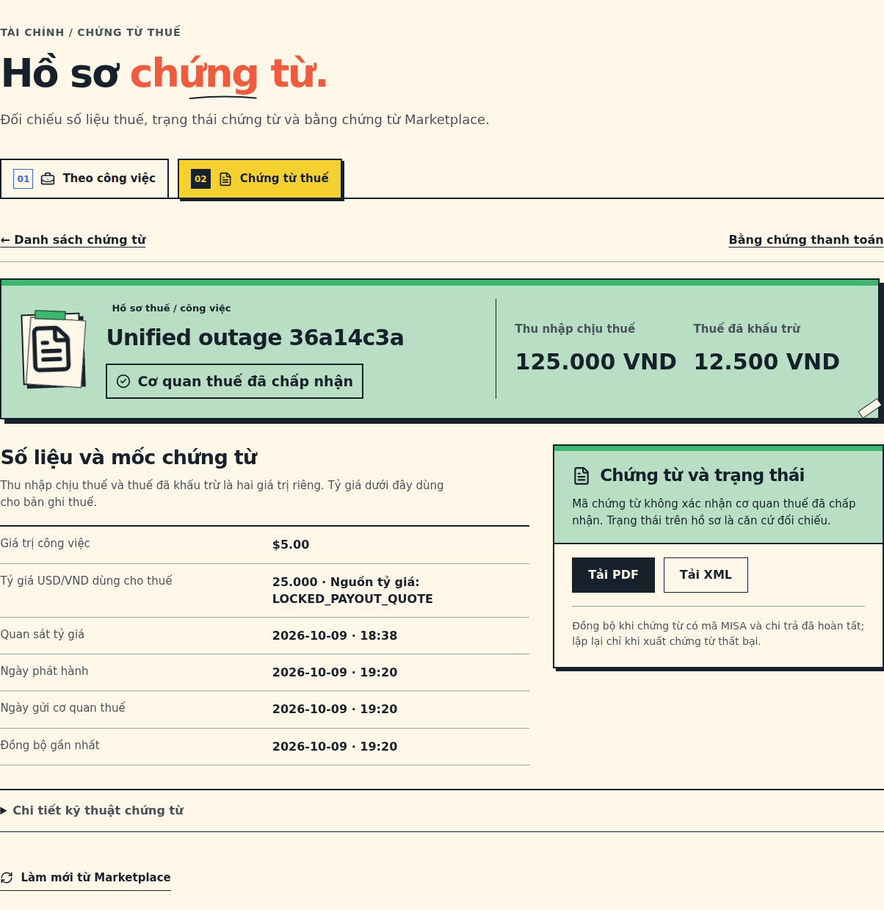
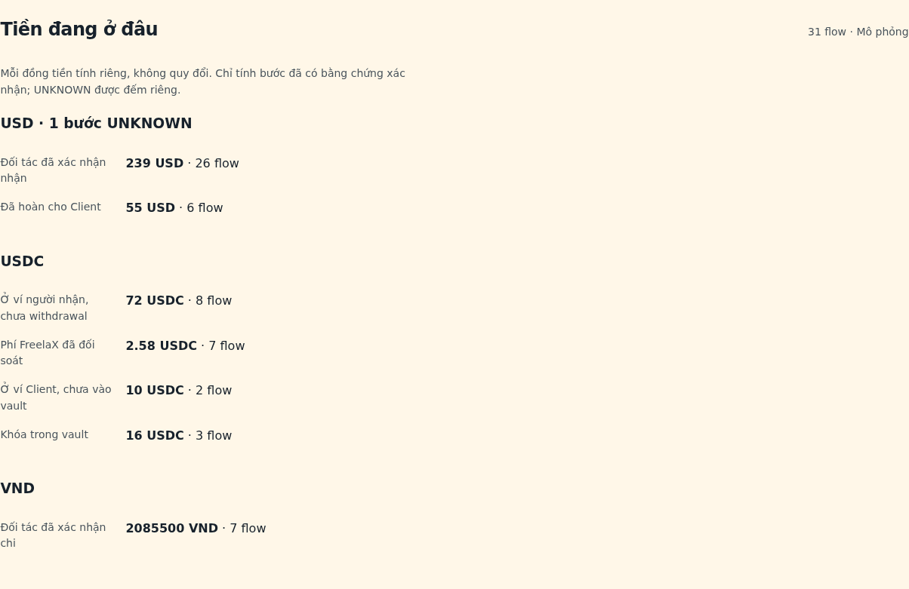

# Guide trình diễn luồng sản phẩm trên trình duyệt

Guide này đi qua luồng sản phẩm bằng giao diện: từ đăng Job, ký quỹ, bàn giao, **màn quyết định có nút lựa chọn và dòng đếm ngược tự duyệt**, **tranh chấp do Admin xử lý**, đến **rút VND và tải chứng từ thuế**. Mọi số tiền đều là mô phỏng (Mock USDC, đối tác USD/VND mô phỏng, MISA mô phỏng).

Thời gian: khoảng 15–20 phút cho nhánh chính, thêm 5 phút cho nhánh tranh chấp.

## 0. Chuẩn bị

1. Khởi chạy hệ thống theo [README gốc](../../README.md#khởi-chạy-từng-bước) (validator, Compose, bootstrap Mock USDC). Mở `http://localhost:8080`.
2. Môi trường đã chuyển đổi: `.env` có `PAYMENT_FLOW_CUTOVER_ENABLED=true`, nên Job mới tự đi luồng thống nhất.
3. Tài khoản:
   - **Client** và **Freelancer**: tự đăng ký mới ở `/register`, hoặc dùng tài khoản seed (mật khẩu trong `.env`: `DEMO_CLIENT_PASSWORD`, `DEMO_FREELANCER_PASSWORD`).
   - **Admin**: `admin.e2e@example.test`, mật khẩu `DEMO_ADMIN_PASSWORD` (chỉ có ở profile dev).
4. Ví Solana: dùng ví trình duyệt hỗ trợ RPC tùy chỉnh `http://127.0.0.1:9123`. Ví mới cần chút SOL local để trả phí:
   `solana airdrop 2 <địa_chỉ_ví> --url http://127.0.0.1:9123`. USDC của Client đến từ bước on-ramp, không cần nạp tay.
5. Mở hai cửa sổ trình duyệt (hoặc một cửa sổ thường và một cửa sổ ẩn danh) cho Client và Freelancer. Mỗi tài khoản chỉ giữ một phiên đăng nhập; đăng nhập ở nơi khác sẽ đẩy phiên cũ ra.

> Muốn có ngay một Job đang chờ Client quyết định để trình diễn bước 4, chạy từ `solana-stablecoin-payout`:
> `ANCHOR_PROVIDER_URL=http://127.0.0.1:9123 ANCHOR_WALLET=~/.config/solana/id.json ./node_modules/.bin/ts-mocha -p tsconfig.json -t 600000 scripts/local-unified-timeout-e2e.ts`
> Lệnh in ra `jobId`. Job này dùng tài khoản seed và đã đi xong USD → USDC → vault → bàn giao.

## 1. Đăng Job và thống nhất điều khoản

1. **Client** → *Công việc* → *Đăng công việc*: nhập tiêu đề, mô tả, danh mục, ngân sách (ví dụ 12 USD), hạn bàn giao (ít nhất 24 giờ sau), một sản phẩm bàn giao và một điều kiện nghiệm thu. Bấm đăng.
2. Trang Job hiện khối **"Thanh toán thống nhất · Mô phỏng local"**: số USD Client nộp, USDC khóa vào vault, phí 3% Freelancer chịu, tỷ giá, số VND dự kiến, thời hạn duyệt 72 giờ, quy tắc gia hạn, mint và network.
3. **Freelancer** mở cùng Job, tick "Tôi đã đọc và đồng ý điều khoản…", bấm **Ứng tuyển**. Thao tác này dùng được hoàn toàn bằng bàn phím: Tab, Space, Enter.
4. **Client** → *Ứng tuyển* của Job → **Chọn Freelancer** → tick đồng ý điều khoản → **Xác nhận chọn**. Hai bên đã xác nhận cùng một bản điều khoản (cùng fingerprint).

## 2. Ký quỹ

1. Cả hai bên mở trang Job, bấm **Kết nối và xác minh ví** và ký thông điệp xác minh.
2. **Client** điền *Tài khoản ngân hàng Client* (nơi nhận hoàn USD nếu hủy) → **Tạo USD order mô phỏng** → **Xem và xác nhận nộp USD** → **Xác nhận nộp USD mô phỏng**.
3. Đợi vài giây cho tới khi hiện "USDC đã vào ví Client theo receipt on-ramp". Khối **Ký quỹ USDC** xuất hiện: **Chuẩn bị giao dịch ký quỹ** → tick kiểm tra mint, số tiền, hai ví → **Ký và gửi giao dịch**.
4. Job chuyển sang *Đang làm*. Freelancer chỉ thấy form bàn giao khi vault đã có tiền.

Nếu đối tác chậm xác nhận USD, trang chỉ báo đang chờ và không mở công việc. Nếu Client từ chối ký trong ví, trang báo lỗi và không gửi giao dịch nào; bấm ký lại là được.

## 3. Bàn giao

**Freelancer** → trang Job → khối *Gửi bàn giao*: nhập tóm tắt, tick sản phẩm và tiêu chí, dán URL HTTPS bằng chứng → **Gửi bàn giao** → ký trong ví.

## 4. Màn quyết định: nút lựa chọn và đếm ngược tự duyệt

**Client** mở trang Job. Khối **"Bản bàn giao mới nhất"** hiển thị bằng chứng, hạn review và dòng đếm ngược:

- *"Còn N phút đến hạn review"*: tính từ lúc bàn giao, đủ 72 giờ. Hết hạn mà Client chưa quyết định thì hệ thống **tự duyệt và release USDC**, không gia hạn thêm. Khi đó Freelancer cũng có nút **Nhận tiền sau hạn review**.

Ngay bên dưới là khối **"Quyết định của bạn"** với ba lựa chọn:

| Nút | Kết quả |
| --- | --- |
| **Duyệt bàn giao** | Ký trong ví → USDC chuyển từ vault vào ví Freelancer; Job *Hoàn thành* |
| **Yêu cầu chỉnh sửa** | Nhập phản hồi và chọn tiêu chí/sản phẩm liên quan; tối đa 2 lần; đồng hồ review bắt đầu lại khi có bản mới |
| **Mở tranh chấp** | Nhập mã lý do và mô tả → ký trong ví → vault bị khóa, chờ Admin (xem bước 5) |

Để trình diễn nhánh chính, bấm **Duyệt bàn giao** → **Xác nhận duyệt** → ký, rồi chuyển sang bước 6. Thời hạn 72 giờ là thật. Bằng chứng tự duyệt khi hết hạn được kiểm chứng bằng script `local-unified-timeout-e2e.ts` trên bản sao ledger, xem [VERIFICATION](VERIFICATION.md).

## 5. Nhánh tranh chấp (Admin quyết định)

1. **Client** bấm **Mở tranh chấp**, nhập lý do và mô tả:

   

2. Sau khi ký, trang Job hiện **"Tranh chấp đang mở"**. Hai bên có thể bổ sung bằng chứng; tự duyệt và rút tiền đều bị chặn:

   

3. **Admin** → `/admin/disputes`: hàng đợi tranh chấp. Bấm vào mã lý do để mở hồ sơ:

   

4. Bấm **Tiếp nhận hồ sơ** (bằng chứng của các bên bị khóa lại), rồi chọn **Release cho Freelancer** hoặc **Hoàn tiền cho Client**, nhập lý do và xác nhận:

   

   - *Release cho Freelancer*: USDC vào ví Freelancer, tiếp tục ở bước 6.
   - *Hoàn tiền cho Client*: USDC về ví Client. Client vào *Thanh toán* của Job → **Chuẩn bị hoàn USD sau khi gửi USDC về treasury** → **Ký withdrawal bằng ví**. Đối tác hoàn đủ USD, phí 0.

## 6. Freelancer rút VND

**Freelancer** → *Thu nhập* → mở Job (hoặc `/finance?jobId=<id>`). Khối **"Luồng thanh toán của Job"** liệt kê từng bước kèm trạng thái và reference. Bấm **Chuẩn bị đổi USDC sang VND**: quote khóa 1 USDC = 25.000 VND và hiển thị phí 3%. Bấm **Ký withdrawal bằng ví**. Vài giây sau, "VND chi cho Freelancer" và "Phí FreelaX" chuyển sang *Đã xác nhận*, đi kèm link **Xem chứng từ thuế**.

## 7. Xuất chứng từ thuế

Khoảng 30 giây sau khi đối tác xác nhận chi VND, MISA mô phỏng phát hành **chứng từ khấu trừ thuế** cho Freelancer. Cần bản code có [PR #7](https://github.com/TronkIshere/FreelaX/pull/7) (phát hành chứng từ cho luồng unified).

1. **Freelancer** → *Thu nhập* → tab **Chứng từ thuế** (`/finance/tax-records`): danh sách theo Job, kèm thu nhập chịu thuế và trạng thái:

   

2. Bấm **Xem chi tiết**: thu nhập chịu thuế, thuế đã khấu trừ, tỷ giá đã khóa (`LOCKED_PAYOUT_QUOTE`), ngày phát hành và ngày gửi cơ quan thuế. Bấm **Tải PDF** hoặc **Tải XML** để lấy file chứng từ:

   

   Ví dụ Job 5 USD: thu nhập chịu thuế 125.000 VND (5 × 25.000), thuế đã khấu trừ 12.500 VND.

## 8. Admin xem tiền đang ở đâu

**Admin** → `/admin/unified-reconciliation`. Bảng **"Tiền đang ở đâu"** tách riêng USD, USDC và VND (không quy đổi cộng chung). Bên dưới là từng flow với 4 ranh giới đối soát (`MATCHED` / `PENDING` / `MISMATCH` / `UNKNOWN`), lịch sử quyết định, và form ghi quyết định có audit:

## Chạy tự động thay vì bấm tay

| Mục đích | Lệnh (từ `frontend/`) |
| --- | --- |
| Toàn bộ nhánh chính và nhánh hoàn tiền với tài khoản mới | `node scripts/unified-new-account-e2e.mjs` |
| Từ chối ký ví, đối tác chậm, thao tác bằng bàn phím | `node scripts/unified-browser-edge-e2e.mjs` |
| Chụp lại các ảnh trong guide | `node scripts/demo-guide-screenshots.mjs <jobId chờ duyệt> <jobId để mở tranh chấp>` |

Trên WSL thiếu thư viện Chromium thì thêm `LD_LIBRARY_PATH=/tmp/freelax-browser-libs/usr/lib/x86_64-linux-gnu` (xem [VERIFICATION](VERIFICATION.md)).
